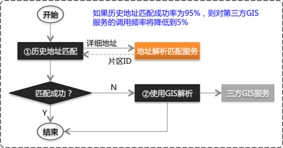
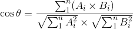
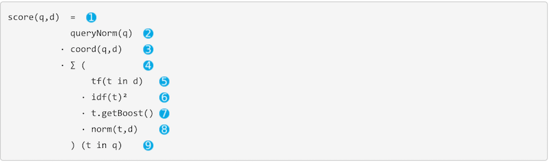
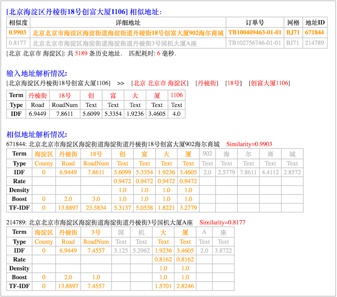

## 项目介绍
在文本相似度算法基础上加入语义处理，从已有历史地址库中搜索匹配相似地址。


### 问题描述
片区划分在物流行业中比较重要，揽收、派送、运输路径规划、配车等核心作业都不同程度依赖片区规划。

传统解决方案一般**重度依赖第三方GIS服务**。受第三方服务本身、网络、通讯协议等诸多因素影响，**性能、吞吐率、可用性**瓶颈比较严重，尤其在双十一等高峰期。

**使用第三方GIS服务时的处理流程：**

1. 在地图上人工预先维护好片区划分，系统记录片区及其边界（多边形顶点）的`经纬度`或`平面坐标`。<br>
   一般使用GIS合作方提供的工具或者[openlayers](http://openlayers.org/)等开源工具完成。
2. 通过GIS服务将详细地址解析出`经纬度`或`平面坐标`。<br>
   GIS服务使用文本匹配算法，通过关键字、相似度等方式将输入地址与GIS地址库中的地址（POI）进行匹配，从而得到`经纬度`或`平面坐标`。
3. 使用空间几何算法，计算出地址坐标位于哪个片区中。<br>
   [openlayers](http://openlayers.org/)等开源工具中包含了这些算法，也可以参考[点在多边形内算法——判断一个点是否在一个复杂多边形的内部](http://blog.csdn.net/hjh2005/article/details/9246967)、[判断一个点是否在多边形内 C++](http://blog.csdn.net/orange_xxx/article/details/7445803)自己实现。


### 解决方案
物流公司在长期运营过程中积累了大量历史地址数据，其中包含了```[地址]<<-->>[片区]```对应关系，基于这些历史数据建立自己的地址匹配服务，可以降低第三方GIS的不利影响，节约费用。

本项目研究使用文本相似度，并加入语义处理，基于历史地址库进行地址解析和匹配。项目处于研究验证阶段，使用500万历史地址的情况下，匹配结果准确率比较高。

 <br>
先使用历史地址数据进行匹配，匹配不成功时再调用GIS服务解析。如果历史数据匹配成功率达到95%，则对GIS服务调用频率将降低到原来的5%。


-------------------------------------------------------------------------
## 算法说明
项目中计算两个地址相似度借鉴了文本`TF-IDF`余弦相似度算法、Lucene的评分算法。

### 文本TF-IDF余弦相似度算法
`TF-IDF`余弦相似度简单直观的说明可以参考[TF-IDF与余弦相似性的应用（一）：自动提取关键词](http://www.ruanyifeng.com/blog/2013/03/tf-idf.html)、[TF-IDF与余弦相似性的应用（二）：找出相似文章](http://www.ruanyifeng.com/blog/2013/03/cosine_similarity.html)。

* `TC`: `Term Count`，词数，某个词在文档中出现的次数。<br />
* `TF`: `Term Frequency`，词频，某个词在文档中出现的频率，`TF = 该词在文档中出现的次数 / 该文档的总词数`。<br />
* `IDF`: `Inverse Document Frequency`，逆文档词频，`IDF = log( 文档总数 / ( 包含该词的文档数 + 1 ) )`。分母加1是为了防止分母出现0的情况。<br />
* `TF-IDF`: 词条的特征值，`TF-IDF = TF * IDF`。 <br>

两个多维空间向量的余弦相似度：

`TF-IDF`余弦相似度是比较通用、有效的文本相似度算法。其它文本相似度相关的算法有：[最长公共子串](https://zh.wikipedia.org/wiki/最长公共子串)、[最长公共子序列](http://baike.baidu.com/view/2020307.htm)、[编辑距离](http://baike.baidu.com/view/2020247.htm)、[汉明距离](http://baike.baidu.com/view/725269.htm)等，基于语义的有LSA/LSI、PLSA、LDA等（参考[既然LDA是一种比PLSA更高级的模型，为啥百度还在用PLSA？](http://www.zhihu.com/question/23642556/answer/38969800)、[CSDN专栏：主题模型 TopicModel](http://blog.csdn.net/column/details/topic-model.html)）。


### Lucene的评分算法
[Elasticsearch: The Definitive Guide](https://www.elastic.co/guide/en/elasticsearch/guide/current/index.html)专门有一个章节比较详细地讲述了Lucene的评分算法：[Theory Behind Relevance Scoring](https://www.elastic.co/guide/en/elasticsearch/guide/current/scoring-theory.html)、[Lucene’s Practical Scoring Function](https://www.elastic.co/guide/en/elasticsearch/guide/current/practical-scoring-function.html)。



* **① score(q, d)** <br>
   查询文档q与文档d的相关性评分值，Lucene中的评分值是一个大于0的实数值。
* **② queuryNorm(q)** <br>
   `queryNorm(q) = 1 / sqrt( sumOfSquaredWeights )`，`sumOfSquaredWeights`是查询文档q中每个词条的`IDF`平方根之和。同理，文档库中的每个文档也会使用这一公式进行归一化处理。<br>
   `queryNorm`的目的是将lucene评分值进行归一化处理，使不同文档之间的评分值具有可比较性，但这个归一化算法严谨性有待证明。相比较之下，余弦相似度算法的结果无需额外的归一化处理。
* **③ coord(q, d)** <br> 
   `coord(q, d) = 文档d中匹配上的词条数量 / 文档q的词条数量` <br>
   `coord`的效果是根据匹配词条数量进行加权，匹配词条越多加权值越高，表示查询文档q与文档d相关性越高，如果查询文档q的所有词条都能匹配，则`coord`值为1。
* **④ ∑(...)(t in q)** <br>
   对查询文档q中的每个词条t，使用公式⑤⑥⑦⑧求值，将得到的值求和汇总。
* **⑤ tf(t in d)** <br>
   注意，这里的TF是词条t在文档d中的词频。
* **⑥ idf(t)²** 
* **⑦ t.getBoost()** <br>
   Lucene的数据结构：
   * 每个文档Document由N个Field组成，Field类型可以是数值、文本、日期等，文本类型的Field经过分词后会包含N个词条Term。
   * 可以使用索引(Index)为文档分组，例如按时间方式建立文档索引，索引`2016_09`中存放9月份的文档，索引`2016_10`中存放10月份的文档。
   Lucene提供`Boost`参数为相关性加权，可以为文档的不同Field设置不同的`Boost`，也可以为索引设置`Boost`（例如索引`2016_10` `Boost`=2.0，索引`2016_09` `Boost`=1.5）。
* **⑧ norm(t,d)** <br>
   `norm(t, d) = 1 / sqrt( numTerms )`，`numTerms`是文档d的词条数量。<br>
   `norm(t, d)`是基于文档/Field长度进行的归一化处理，其效果是，同一个词条，出现在较短的Field（例如Title）中，比出现在较长的Field（例如Content）的相关性更高。<br>
   另外，`TF-IDF`的一些实际运用中会对TF使用这种方式进行计算，即`TF = 该词在文档中出现的次数 / sqrt( 该文档的总词数 )`


### 地址相似度算法

地址相似度计算具有如下特点：

1. 地址不同于文章，文章是纯自然语言，而地址是格式规范性较强的短语。<br>
   在这里通用的分词技术显得不足，例如：
   * `海淀区`、`万达广场`不仅仅是一个词条，它们代表了`区县`、`POI`语义。
   * 查询文档`...南京东路378号...`，如果历史地址中不存在`378号`，但却有`...南京东路380号...`、`...南京东路377号...`，则这些地址的相似度非常高，
   不能因为其他文本的干扰导致它们的相似度变低，这需要理解`道路名`、`门牌号`语义并进行处理。<br>
   **结论：添加语义处理对地址相似度准确率的影响比较大。如果历史数据量足够大，覆盖率高，文本相似度即可实非常高的准确率，在历史数据量有限的情况下，
   语义处理对准确率的提升具有关键作用。**
2. 地址的特征并不是通过特征词的重复得以强化，而是通过特定组成部分强化的，例如道路名+门牌号、小区名等。<br>
   **结论：词频TF在地址相似度计算中没有意义，结合语义对不同组成部分设置不同加权权重对地址相似度的影响非常重要。**

<pre>
注意事项
1. 历史数据量的大小是影响精确度的重要因素
  1.1 历史数据量越大，精确度越高。历史数据量小于一定程度，匹配结果的准确性会非常低。
  1.2 目前精确到区县一级进行匹配，地址必须包含区县，且历史数据大小不能只看全国总量，需具体到每个区县。
  1.3 POI的分布密度和片区的粗细粒度不同，对历史数据量的要求不一样。
      例如农村地区POI密度低，片区划分粒度粗，仅需少量历史数据就能实现高精确度，但城市地区不行。
2. 边界地区精准度存在一定的不确定性
   例如某条道路南面属于A区，北面属于B区，该道路上的地址匹配结果为A区还是B区存在不确定性。
   GIS同样无法实现100%精确，因为解析经纬度同样使用非结构化文本匹配方式。但GIS POI数据多，精确度相对较高。
3. 片区范围调整时需要保留出足够的学习积累期
   例如某片区一分为二，或两片区合并的情况。
   一个简单解决方案：如果结果落在该片区则认为无效，client重新从GIS得到片区ID，留出一段时间为该片区积累历史数据。
</pre>

-------------------------------------------------------------------------
## 安装运行

### 编译打包
下载源码：
```shell
git clone https://github.com/liuzhibin-cn/address-similarity.git /your/src/path/
```

使用`src/main/resources/conf/script/db-and-init-data.sql`创建数据库和初始化省市区区域数据。

修改`pom.xml`文件，在`profile`节点`test`下面设置数据库连接信息。

执行`maven`命令编译打包_（项目开发和测试环境使用的JDK1.8，项目使用的Dubbox也是在JDK1.8版本下源码编译的）_：
```shell
mvn clean package -P test
```

将生成的压缩包解压到运行目录：
```shell
mv target/address-match.tar.gz /your/dist/path/
cd /your/dist/path/
tar -xvzf address-match.tar.gz
```


### 准备历史数据
运行demo服务需要先导入历史地址数据。

按照`src/test/resources/test-addresses.txt`的格式准备好历史数据文件。

执行下面命令将历史数据导入数据库：
```shell
bin/imp_address.sh /your/history/data/file/path
```

执行下面命令为全部地址计算词语特征值，并缓存到文件中：
```shell
bin/build_vector.sh
```
缓存目录通过`pom.xml` `profile`中的`<cache.path></cache.path>`节点进行设置，如果未设置，默认路径为`~/.vector_cache/`


### 运行服务
运行下面命令启动demo服务：
```shell
bin/start.sh
```
停止服务使用`bin/stop.sh`。

服务启动成功后，通过`http://localhost:8000/address/demo/find/北京海淀区丹棱街18号创富大厦1106?top=5`访问。<br>
Demo服务运行效果如下：<br>


Demo服务使用的`Dubbox`的REST接口，服务启动时会监听2个端口：`8080`和`8000`。
如果需要修改为其他端口号，请修改以下文件：
```xml
spring-config.xml
<dubbo:protocol name="rest" server="jetty" host="127.0.0.1" port="8000" contextpath="test"
	extension="com.alibaba.dubbo.rpc.protocol.rest.support.LoggingFilter" />
<dubbo:service interface="com.rrs.rd.address.demo.HttpDemoService" ref="demoService" register="false" protocol="rest" />
```

```shell
bin/start.sh
echo -e "Starting the service ...\c"
nohup java -Ddubbo.spring.config=spring-config.xml -Ddubbo.jetty.port="8080" -Ddubbo.jetty.page=log,status,system -classpath $CONF_DIR:$CONF_DIR/dic:$LIB_JARS com.alibaba.dubbo.container.Main spring jetty > $DEPLOY_DIR/log/address-service-stdout.log 2>&1 &
```


-------------------------------------------------------------------------
## 更新日志
* ❓行政区域StdDivision中的街道、乡镇等还未参与相似度计算。
* ❓提升准确率：从网络抓取全国小区名称，作为分词词库。
* ❓提升准确率：支持四级地址。从京东、天猫抓取四级地址，提高地址解析、匹配的准确度。
* ✅性能优化+结构优化+提升准确率：使用`倒排索引` `Inverted Index`匹配省市区。_Done 20161018_
    * 将全部省市区名称、别名建立倒排索引；
    * 在搜索相似地址进行地址解析时，基于倒排索引匹配省市区，替换掉原来使用硬编码匹配省市区的方式；
* ✅提升准确率：借鉴`elasticsearch`的评分算法。_Done 20160925_
* ✅优化分析：引入`velocity`生成demo service的html输出，输出分词等更详细信息，辅助分析准确率。_Done 20160922_
* ✅结构优化：将`AddressService`中地址解析和数据持久化逻辑分离。_Done 20160922_
* ✅性能优化：提升搜索相似地址的处理速度。_Done 20160921_
    * 缓存从地级市细化到到区县一级；
    * 余弦相似度算法性能优化；
* ✅提升准确率：匹配结果准确度不够理想。_Done 20160921_
	* 更改标准`TF-IDF`算法，将`词频TF`改为对地址不同组成部分设置自定义权重。
* ✅功能完善：添加部署测试服务器所需功能，方便内测和验证。_Done 20160919_
    * 将`Dubbo`更换为`Dubbox`，使用`dubbox`的REST API暴露HTTP测试验证接口；
    * 添加管理用`shell`脚本，方便测试环境编译部署；