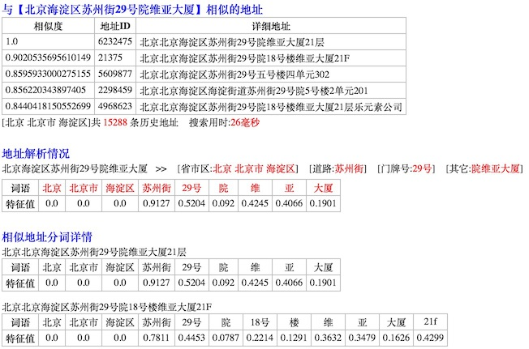

## 项目简介
使用文本相似度算法，从已有历史地址库中搜索匹配相似地址。<br>


### 问题描述
片区划分在物流行业中比较重要，揽收、派送、运输路径规划、配车等核心作业都不同程度依赖片区规划。
传统解决方案一般**重度依赖第三方GIS服务**。受第三方服务本身、网络、通讯协议等诸多因素影响，**性能、吞吐率、可用性**瓶颈比较严重，尤其在双十一等高峰期。

**使用第三方GIS服务时的处理流程：**

1. 在地图上人工预先维护好片区划分，系统记录片区及其边界（多边形顶点）的`经纬度`或`平面坐标值`。<br>
   一般使用GIS合作方提供的工具或者[openlayers](http://openlayers.org/)等开源工具完成。
2. 通过GIS服务将详细地址解析出`经纬度`或`平面坐标值`。<br>
   GIS服务使用文本匹配算法，通过关键字、相似度等方式将输入地址与GIS地址库中的地址（POI）进行匹配，从而得到`经纬度`或`平面坐标值`。
3. 使用空间几何算法，计算出地址坐标位于哪个片区中。<br>
   [openlayers](http://openlayers.org/)等开源工具中包含了这些算法，[CSDN: 点在多边形内算法——判断一个点是否在一个复杂多边形的内部](http://blog.csdn.net/hjh2005/article/details/9246967)、[CSDN: 判断一个点是否在多边形内 C++](http://blog.csdn.net/orange_xxx/article/details/7445803)有各种算法的说明。


### 解决方案
物流公司在长期运营过程中积累了大量历史地址数据，其中包含了```[地址]<<-->>[片区]```对应关系，基于这些历史数据建立自己的地址匹配服务，可以降低第三方GIS的不利影响，节约费用。

本项目研究使用文本相似度，基于历史地址库进行地址解析和匹配。<br>
项目处于研究验证阶段，使用500万历史地址的情况下，匹配结果准确率比较高。

<pre>
注意事项
1. 历史数据量的大小是影响精确度的重要因素
  1.1 历史数据量越大，精确度越高。历史数据量小于一定程度，匹配结果的准确性会非常低。
  1.2 目前精确到区县一级进行匹配，地址必须包含区县，且历史数据大小不能只看全国总量，需具体到每个区县。
  1.3 POI的分布密度和片区的粗细粒度不同，对历史数据量的要求不一样。
      例如农村地区POI密度低，片区划分粒度粗，仅需少量历史数据就能实现高精确度，但城市地区不行。
2. 边界地区精准度存在一定的不确定性
   例如某条道路南面属于A区，北面属于B区，该道路上的地址匹配结果为A区还是B区存在不确定性。
   GIS同样无法实现100%精确，因为解析经纬度同样使用非结构化文本匹配方式。但GIS POI数据多，精确度相对较高。
3. 片区范围调整时需要保留出足够的学习积累期
   例如某片区一分为二，或两片区合并的情况。
   一个简单解决方案：如果结果落在该片区则认为无效，client重新从GIS得到片区ID，留出一段时间为该片区积累历史数据。
</pre>


-------------------------------------------------------------------------
## 算法说明
 
### 标准TF-IDF算法
**TC: Term Count**，词数，某个词在文档中出现的次数。<br />
**TF: Term Frequency**，词频，某个词在文档中出现的频率，_TF = 该词在文档中出现的次数 / 该文档的总词数_。<br />
**IDF: Inverse Document Frequency**，逆文档词频，_IDF = log( 文档总数 / ( 包含该词的文档数 + 1 ) )_。分母加1是为了防止分母出现0的情况。<br />
**TF-IDF**: 词语的特征值，_TF-IDF = TF * IDF_。 


### 基于标准TF-IDF算法的调整
计算地址相似度时，将标准TF-IDF算法中的词频TF改为了自定义的词语权重值，因为：

1. 地址不同于文章，文章是纯自然语言，而地址是格式规范性较强的短语；
2. 地址的特征并不是通过特征词的重复得以强化，而是通过特定组成部分强化的，例如道路名+门牌号、小区名等；


### 地址相似度计算逻辑

1. 对地址解析后（导入地址时完成）剩余无法进一步解析的文本进行分词，这些词语采用正常权重；
2. 在词语前面依次添加省份、地级市、区县、街道/乡镇、村庄、道路、门牌号等词语，这些词语采用自定义权重；<br>
    取高权重：省份、地级市、区县、乡镇、村庄、道路<br />
    中等权重：门牌号<br />
    取低权重：街道<br />
3. 在全部文档中为所有词语统计逆文档引用情况；<br />
4. 为文档中的每个词语计算IDF；<br />
5. 为两个文档计算余弦相似度；

-------------------------------------------------------------------------
## 安装运行

### 编译打包
下载源码：
```shell
git clone https://github.com/liuzhibin-cn/address-similarity.git /your/src/path/
```

使用`src/main/resources/conf/script/db-and-init-data.sql`创建数据库和初始化省市区区域数据。

修改`pom.xml`文件，在`profile`节点`test`下面设置数据库连接信息。

执行maven命令编译打包_（项目开发和测试环境使用的JDK1.8，项目使用的Dubbox也是在1.8版本下源码编译的）_：
```shell
mvn clean package -P test
```

将生成的压缩包解压到运行目录：
```shell
mv target/address-match.tar.gz /your/dist/path/
cd /your/dist/path/
tar -xvzf address-match.tar.gz
```


### 准备历史数据
运行demo服务需要先导入历史地址数据。

按照`src/test/resources/test-addresses.txt`的格式准备好历史数据文件。

执行下面命令将历史数据导入数据库：
```shell
bin/imp_address.sh /your/history/data/file/path
```

执行下面命令为全部地址计算词语特征值，并缓存到文件中：
```shell
bin/build_vector.sh
```
缓存目录通过`pom.xml` `profile`中的`<cache.path></cache.path>`节点进行设置，如果未设置，默认路径为`~/.vector_cache/`


### 运行服务
运行下面命令启动demo服务：
```shell
bin/start.sh
```
停止服务使用`bin/stop.sh`。

服务启动成功后，通过`http://localhost:8000/test/address/find/北京海淀区苏州街29号院18号楼维亚大厦`访问。<br>
Demo服务运行效果如下：<br>


Demo服务使用的Dubbox的REST接口，服务启动时会监听2个端口：`8080`和`8000`。
如果需要修改为其他端口号，请修改以下文件：
```xml
spring-config.xml
<dubbo:protocol name="rest" server="jetty" host="127.0.0.1" port="8000" contextpath="test"
	extension="com.alibaba.dubbo.rpc.protocol.rest.support.LoggingFilter" />
<dubbo:service interface="com.rrs.rd.address.demo.HttpDemoService" ref="demoService" register="false" protocol="rest" />
```

```shell
bin/start.sh
echo -e "Starting the service ...\c"
nohup java -Ddubbo.spring.config=spring-config.xml -Ddubbp.jetty.port="8080" -Ddubbo.jetty.page=log,status,system -classpath $CONF_DIR:$CONF_DIR/dic:$LIB_JARS com.alibaba.dubbo.container.Main spring jetty > $DEPLOY_DIR/log/address-service-stdout.log 2>&1 &
```


-------------------------------------------------------------------------
## 更新日志
* ❓机制简化：去除特征向量文件缓存处理，改为在实时请求处理时构建内存缓存。
* ❓提升准确率：从网络抓取全国小区名称，作为分词词库。
* ✅提升准确率：借鉴elasticsearch的评分算法。_Done 20160925_
* ✅优化分析：引入velocity生成demo service的html输出，输出分词等更详细信息，辅助分析准确率。_Done 20160922_
* ✅结构优化：将AddressService中地址解析和数据持久化逻辑分离。_Done 20160922_
* ✅性能优化：提升搜索相似地址的处理速度。_Done 20160921_
    * 缓存从地级市细化到到区县一级；
    * 余弦相似度算法性能优化；
* ✅提升准确率：匹配结果准确度不够理想。_Done 20160921_
	* 更改标准TF-IDF算法，将词频TF改为对地址不同组成部分设置自定义权重。
* ✅功能完善：添加部署测试服务器所需功能，方便内测和验证。_Done 20160919_
    * 将Dubbo更换为Dubbox，使用dubbox的REST API暴露HTTP测试验证接口；
    * 添加管理用shell脚本，方便测试环境编译部署；